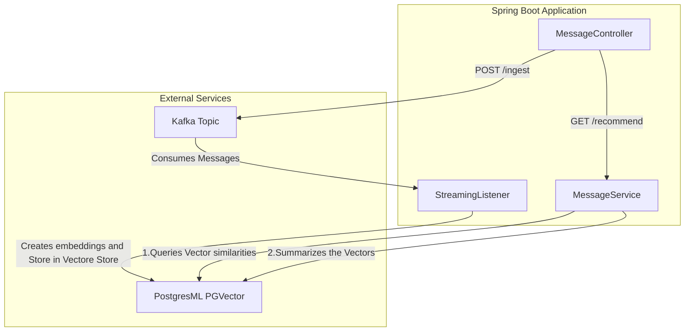

# Generative AI Recommender

This is a backend for a Generative AI recommender that includes:
- PostgresML
- PGVector
- Spring Boot and AI

## Structure of the Project

Project has two endpoints:
- `/ingest` receives a message and puts it into a Kafka topic
- `/recommend` serves a prompt and queries similar data in vector store by considering `cosine distance`

And a Kafka listener which listens to a topic for messages for ingestion and generates an embedding for storing in Vectore store.
Vector store uses PostgresML to generate the embeddings of the messages and stores it in Postgres Database.

## How to run

Go to the root of project and open a command line terminal and setup the dependencies by running following command where you have docker installed:
```bash
docker compose up -d
```
Then run followings in the root of project
```bash
./gradlew bootJar
java -jar build/libs/streaming-0.0.1-SNAPSHOT.jar
```
This will run the server at port 8080.

Send following HTTP call to train the system
```HTTP
POST http://localhost:8080/
Content-Type: application/json

{
  "message": "hey there",
  "subject": "test subject",
  "items": 300
}
```

After generating the embeddings you can hit recommend api to get the scores and approximations
```HTTP
GET http://localhost:8080/recommend?prompt=hello&size=2
```

To clean up after:
```bash
docker compose down -v
```

## Architecture diagram



### TODO
- [ ] add tests
- [ ] dockerize project
- [ ] github actions
- [x] architecture diagram
